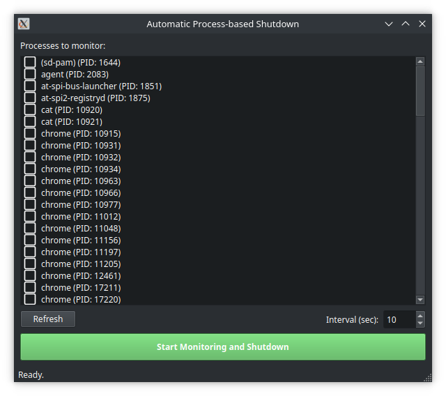

# Delayed Shutdown

A simple GUI application to shut down your computer after a set of specified processes have finished executing.



## Features

- **Process Monitoring:** Select one or more running processes to monitor.
- **Automatic Shutdown:** The application will automatically shut down the computer once all monitored processes have finished.
- **Customizable Interval:** Set the monitoring interval to check if the processes have finished.
- **Shutdown Countdown:** A configurable countdown is initiated before shutting down, which can be canceled.

## Installation

You can install the application using `pip`. This will also automatically create a desktop entry, so you can find it in your application menu.

### From a local clone

If you have cloned the repository, you can install it by running the following command from the project's root directory:

```bash
pip install .
```

### Using pipx (recommended)

For a clean, isolated installation, you can use `pipx`.

#### From a local clone

```bash
pipx install .
```

#### From GitHub

You can also install it directly from the GitHub repository:

```bash
pipx install git+https://github.com/arrase/delayed-shutdown.git
```

## Configuration

### Run Shutdown Without a Password

To allow the application to shut down the system without asking for a password, you need to configure `sudo`. This allows the `shutdown` command to be executed without user interaction.

**Warning:** Editing the `sudoers` file incorrectly can leave your system in an unstable state. Proceed with caution.

1.  **Find the `shutdown` command path:**
    Open a terminal and run:
    ```bash
    which shutdown
    ```
    This will give you the full path to the command, for example, `/usr/sbin/shutdown`. Copy it.

2.  **Edit the `sudoers` file:**
    The safest way to edit this file is with the `visudo` command, which checks the syntax before saving.
    ```bash
    sudo visudo
    ```

3.  **Add the rule:**
    Add the following line to the end of the file. **Important:** Replace `<YOUR USER>` with your username and `<PATH TO SHUTDOWN>` with the path you copied in the first step.

    ```
    <YOUR USER> ALL=(ALL) NOPASSWD: <PATH TO SHUTDOWN>
    ```

    For example, if your user is `john` and the path is `/usr/sbin/shutdown`, the line would be:
    `john ALL=(ALL) NOPASSWD: /usr/sbin/shutdown`

4.  **Save and exit.** In `visudo` (which typically uses an editor like `vi` or `nano`), save the changes and exit. If you're using `vi`, press `Esc` and type `:wq`. If you're using `nano`, press `Ctrl+X`, then `Y`, and `Enter`.

## Usage

After installation, you can run the application from your terminal:

```bash
delayed-shutdown
```

Or you can find it in your applications menu.

This will open a window where you can select the processes to monitor. You can also set the monitoring interval and the shutdown countdown time. Once you've selected the desired processes, click "Start Monitoring and Shutdown". The application will wait for all selected processes to close and then initiate the shutdown countdown.

## Contributing

Contributions are welcome! Please feel free to submit a pull request or open an issue if you have any suggestions or find any bugs.

## License

This project is licensed under the MIT License. See the [LICENSE](LICENSE) file for details.
