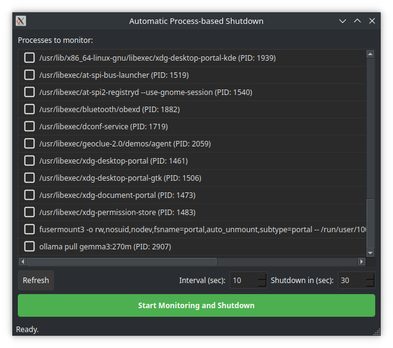

# Delayed Shutdown

A simple GUI application to shut down your computer after a set of specified processes have finished executing.

Tested on Ubuntu ... and should work on Mac OS X (let me know).



## Features

- **Process Monitoring:** Select one or more running processes to monitor.
- **Automatic Shutdown:** The application automatically shuts down the computer once all monitored processes have finished.
- **System Tray Integration:** The application runs in the system tray, allowing it to operate in the background without cluttering the desktop. The main window can be opened and hidden easily.
- **Dynamic and Interactive UI:** The interface changes based on the application's state (idle, monitoring, or shutdown countdown), providing clear visual feedback.
- **Customizable Intervals:** Set the monitoring interval and the shutdown countdown time.
- **Responsive Process Selection:** The process list can be refreshed at any time, and selections are preserved. Processes can be selected or deselected with a single click on the item.

## Installation

This project has two recommended installation methods: one for end-users and one for developers.

### For End-Users (Recommended)

The best way to install `delayed-shutdown` is using `pipx`, which installs the application and its dependencies in an isolated environment. This prevents conflicts with other Python packages on your system.

1.  **Install pipx:**
    If you don't have `pipx` installed, follow the official installation instructions: [Install pipx](https://pipx.pypa.io/stable/installation/).

2.  **Install the application:**
    You can install `delayed-shutdown` directly from its GitHub repository:
    ```bash
    pipx install git+https://github.com/arrase/delayed-shutdown.git
    ```

#### Creating a Desktop Entry on Linux

After installing with `pipx`, you can create a desktop entry to launch the application from your system's application menu.

Run the following command in your terminal to download and execute the creation script.
```bash
bash <(curl -sS https://raw.githubusercontent.com/arrase/delayed-shutdown/refs/heads/main/create_desktop_entry.sh)
```

This will create a `delayed-shutdown.desktop` file in `~/.local/share/applications`. You may need to log out and log back in for the application to appear in your menu.

### For Developers

If you want to contribute to the project, you should set up a local development environment.

1.  **Clone the repository:**
    ```bash
    git clone https://github.com/arrase/delayed-shutdown.git
    cd delayed-shutdown
    ```

2.  **Create and activate a virtual environment:**
    ```bash
    python3 -m venv .venv
    source .venv/bin/activate
    ```

3.  **Install the project in editable mode:**
    This will install the package, but any changes you make to the source code will be immediately reflected when you run the application.
    ```bash
    pip install -e .
    ```

## Configuration

### Run Shutdown Without a Password

To allow the application to shut down the system without asking for a password, you need to configure `sudo`. This allows the `shutdown` command to be executed without user interaction.

**Warning:** Editing the `sudoers` file incorrectly can leave your system in an unstable state. Proceed with caution.

1.  **Find the `shutdown` command path:**
    Open a terminal and run:
    ```bash
    which shutdown
    ```
    This will give you the full path to the command, for example, `/usr/sbin/shutdown`. Copy it.

2.  **Edit the `sudoers` file:**
    The safest way to edit this file is with the `visudo` command, which checks the syntax before saving.
    ```bash
    sudo visudo
    ```

3.  **Add the rule:**
    Add the following line to the end of the file. **Important:** Replace `<YOUR USER>` with your username and `<PATH TO SHUTDOWN>` with the path you copied in the first step.

    ```
    <YOUR USER> ALL=(ALL) NOPASSWD: <PATH TO SHUTDOWN>
    ```

    For example, if your user is `john` and the path is `/usr/sbin/shutdown`, the line would be:
    `john ALL=(ALL) NOPASSWD: /usr/sbin/shutdown`

4.  **Save and exit.** In `visudo` (which typically uses an editor like `vi` or `nano`), save the changes and exit. If you're using `vi`, press `Esc` and type `:wq`. If you're using `nano`, press `Ctrl+X`, then `Y`, and `Enter`.

## Usage

After installation, run the application from your terminal or the applications menu:

```bash
delayed-shutdown
```

The application will start minimized in the system tray.

### Interacting with the Application

- **Show/Hide the window:** A single click on the system tray icon will show or hide the main window.
- **Main menu:** A right-click on the icon will open a menu with options to show the window or exit the application.

Inside the main window, you can select the processes to monitor, set the monitoring interval, and define the shutdown countdown time. Once you have selected the desired processes, click "Start Monitoring and Shutdown". The application will wait for all selected processes to close and then begin the shutdown countdown.

## Contributing

Contributions are welcome! Please feel free to submit a pull request or open an issue if you have any suggestions or find any bugs.

## License

This project is licensed under the MIT License. See the [LICENSE](LICENSE) file for details.

## Disclaimer

The content of this repository has been generated by AI